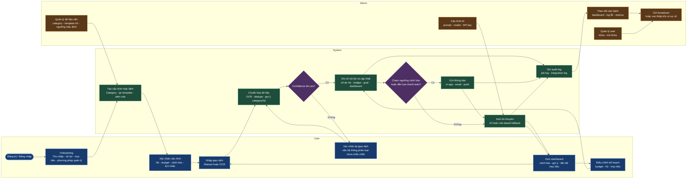
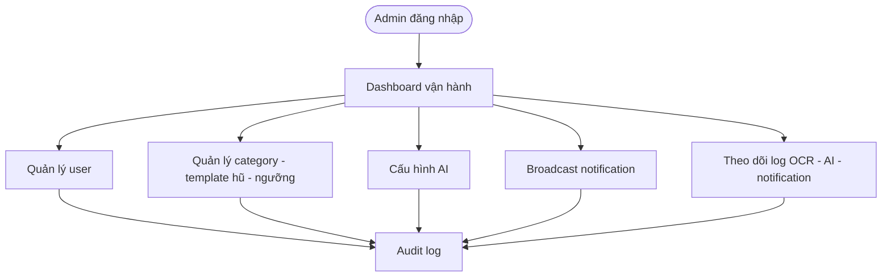

# Luồng nghiệp vụ tổng thể - Personal Finance App

## 1) Mục tiêu tài liệu

Tài liệu này chốt lại luồng nghiệp vụ cho hệ thống quản lý tài chính cá nhân theo phương pháp nhiều hũ chi tiêu, bám theo context hiện tại của nhóm:

- Trọng tâm là `Chi tiêu + Tiết kiệm + Cảnh báo + Gợi ý`.
- MVP triển khai trong `1 tháng`.
- Hệ thống phục vụ `2 actor người dùng chính`: `User` và `Admin`.
- `System` được xem là actor tự động hóa trong flowchart, không chỉ là tập hợp service phụ trợ.

Mục tiêu của tài liệu:

- Chuẩn hóa core flow để FE và BE cùng bám vào khi implement.
- Loại bỏ các góc nhìn cũ không còn phù hợp với context mới của dự án.
- Xác định rõ phần nào là `core MVP`, phần nào là `optional/phase sau`.

---

## 2) Phạm vi MVP và các giả định đã chốt

### 2.1 Quyết định nghiệp vụ cho MVP

| Câu hỏi | Chốt cho MVP |
| --- | --- |
| Actor chính của hệ thống là ai? | `User`, `Admin`; ngoài ra có `System` là actor tự động hóa trong flow |
| Nền tảng triển khai? | `Web app`, UI thiết kế theo hướng dễ dùng và có thể mở rộng `PWA-friendly` |
| App có giữ tiền của user không? | `Không`. App chỉ quản lý sổ cái nội bộ, phân bổ ngân sách và mục tiêu |
| Hũ trong hệ thống là gì? | `Hũ` là đơn vị phân bổ ngân sách/tiết kiệm nội bộ, không phải ví ngân hàng thật |
| Nguồn số dư ban đầu lấy từ đâu? | User tự khai báo `tài khoản/nguồn tiền`; bank-link là hướng mở rộng, không phải dependency của core flow |
| Giá trị cốt lõi của MVP là gì? | Onboarding nhanh, quản lý nhiều hũ, nhập giao dịch, cảnh báo ngưỡng, nhắc thanh toán, gợi ý tiết kiệm |
| Có AI không? | Có. AI dùng để sinh lời khuyên chi tiêu; khi AI lỗi thì fallback về rule-based |
| Có OCR hóa đơn không? | Có, đây là một input channel quan trọng của giao dịch |
| Có ví chung / mời bạn bè không? | Có thể làm `optional`, không đưa vào core flow của MVP |
| Có CSKH/chat trong app không? | Không xem là core flow của MVP hiện tại |
| App có tự động thanh toán hộ user không? | Không |

### 2.2 Những điểm cần hiểu đúng trong dự án

1. `App không giữ tiền`, nên mọi thao tác "chuyển tiền giữa các hũ" chỉ là `chuyển phân bổ ngân sách nội bộ`, không phải chuyển khoản ngân hàng thật.
2. `System` không chỉ là OCR hay Notification service. Trong flow thực tế, `System` còn chịu trách nhiệm:
   - Sinh cấu hình mặc định sau onboarding.
   - Phân loại giao dịch.
   - Tính số dư, hạn mức, tiến độ mục tiêu.
   - Kiểm tra ngưỡng cảnh báo.
   - Sinh gợi ý AI/rule-based.
3. `Bank sync` không nên nằm ở trung tâm của MVP. Core flow phải chạy ổn định chỉ với:
   - Khai báo số dư ban đầu.
   - Nhập tay giao dịch.
   - OCR hóa đơn.
4. `Ví chung`, `CSKH/chat`, `auto payment` là hướng mở rộng, không nên kéo vào flowchart chính nếu nhóm đang ưu tiên hoàn thiện core domain trong 1 tháng.

---

## 3) Core của từng actor

### 3.1 User core

`User` là actor tạo dữ liệu nghiệp vụ và ra quyết định tài chính hằng ngày.

Core responsibility:

- Khởi tạo hồ sơ tài chính ban đầu.
- Chọn phương pháp/quy tắc quản lý chi tiêu phù hợp.
- Tạo và quản lý hũ chi tiêu, mục tiêu tiết kiệm, hạn mức.
- Ghi nhận giao dịch bằng tay hoặc qua OCR.
- Xác nhận lại dữ liệu khi hệ thống phân loại chưa chắc chắn.
- Theo dõi dashboard, cảnh báo, nhắc thanh toán, gợi ý.
- Điều chỉnh kế hoạch chi tiêu khi hệ thống phát hiện rủi ro.

### 3.2 Admin core

`Admin` là actor quản trị vận hành và cấu hình hệ thống.

Core responsibility:

- Quản lý người dùng: xem, tìm kiếm, khóa/mở khóa tài khoản.
- Quản lý dữ liệu nền: category mặc định, template hũ, ngưỡng mặc định.
- Cấu hình AI: `system prompt`, `model`, `API key`, trạng thái bật/tắt AI.
- Quản lý thông báo toàn hệ thống.
- Theo dõi dashboard vận hành, log lỗi OCR/AI/notification/job.

### 3.3 System core

`System` là actor tự động hóa, đứng giữa hành vi của `User` và năng lực kiểm soát của `Admin`.

Core responsibility:

- Tạo bộ cấu hình khởi tạo sau onboarding.
- Chuẩn hóa và phân loại giao dịch.
- Cập nhật số dư hũ, ngân sách, mục tiêu, dashboard.
- Kiểm tra cảnh báo ngưỡng chi tiêu và cảnh báo số dư thấp.
- Theo dõi lịch thanh toán định kỳ và sinh nhắc việc.
- Tạo lời khuyên bằng AI hoặc fallback rule-based.
- Ghi audit log và integration log để admin theo dõi.

### 3.4 Tóm tắt core theo một câu

- `User`: lập kế hoạch, ghi nhận chi tiêu, phản ứng với cảnh báo.
- `Admin`: cấu hình hệ thống và giữ cho hệ thống vận hành đúng.
- `System`: tự động hóa phân tích, nhắc nhở và gợi ý.

---

## 4) Luồng tổng thể end-to-end

### 4.1 Luồng mức cao

1. User đăng ký/đăng nhập và hoàn tất onboarding.
2. System sinh cấu hình ban đầu dựa trên hồ sơ, phương pháp quản lý và template mặc định.
3. User xác nhận hoặc chỉnh sửa hũ, hạn mức, mục tiêu, lịch nhắc thanh toán.
4. User phát sinh giao dịch bằng nhập tay hoặc OCR hóa đơn.
5. System chuẩn hóa dữ liệu, dedupe, phân loại category/hũ.
6. Nếu độ tin cậy thấp, System yêu cầu User xác nhận trước khi ghi sổ.
7. Khi giao dịch hợp lệ, System cập nhật số dư hũ, ngân sách, mục tiêu và dashboard.
8. System kiểm tra:
   - Có chạm ngưỡng cảnh báo không?
   - Có sắp đến hạn thanh toán định kỳ không?
9. Nếu có, System gửi notification cho user.
10. System cập nhật lời khuyên theo `event` hoặc theo `lịch định kỳ`, dùng AI nếu khả dụng và fallback sang rule-based khi cần.
11. User xem dashboard, nhận cảnh báo và điều chỉnh kế hoạch chi tiêu.
12. Admin cấu hình dữ liệu nền, AI và theo dõi log để đảm bảo vòng lặp trên vận hành ổn định.

### 4.2 Flowchart hoàn chỉnh cho 3 actor

### 4.3 Ý nghĩa của flowchart mới

- Flowchart này xem `System` là actor trung tâm của automation, đúng với context mới của dự án.
- `Admin` không đi vào flow chi tiêu hằng ngày của user, mà đứng ở lớp `governance/configuration/monitoring`.
- `User` chỉ cần làm những hành động thật sự có giá trị: khai báo, xác nhận, theo dõi, điều chỉnh.

---

## 5) Luồng chi tiết theo phân hệ core

### 5.1 Onboarding và khởi tạo cấu hình tài chính

Input user cung cấp:

- Thu nhập dự kiến.
- Số dư ban đầu theo từng nguồn tiền.
- Mục tiêu tài chính ngắn hạn.
- Phương pháp quản lý mong muốn:
  - Dùng template nhiều hũ mặc định.
  - Dùng template tối giản.
  - Tự cấu hình.

System xử lý:

- Tạo category mặc định.
- Gợi ý bộ hũ phù hợp theo profile.
- Gợi ý tỷ lệ phân bổ ban đầu.
- Gán ngưỡng cảnh báo mặc định.
- Tạo lịch nhắc thanh toán mẫu nếu user có nhu cầu.

Output:

- Một workspace tài chính ban đầu để user chỉnh sửa và bắt đầu dùng ngay.

### 5.2 Quản lý tài khoản nguồn tiền và hũ

Phân biệt rõ:

- `FinancialAccount`: tài khoản/nguồn tiền do user khai báo hoặc liên kết.
- `Jar`: hũ ngân sách nội bộ để quản lý mục tiêu chi tiêu/tiết kiệm.

User có thể:

- CRUD tài khoản nguồn tiền.
- CRUD hũ chi tiêu.
- Chuyển phân bổ giữa các hũ.
- Đặt hạn mức theo ngày/tháng hoặc theo hũ.

Ràng buộc:

- Không được phân bổ vượt quá số dư khả dụng của user.
- Chuyển hũ là thao tác logic nội bộ, không phải giao dịch ngân hàng thật.
- Mọi thay đổi số dư/hạn mức quan trọng phải được ghi audit log.

### 5.3 Nhập liệu giao dịch

Nguồn giao dịch trong core MVP:

- Nhập tay.
- OCR hóa đơn.

Nguồn giao dịch optional:

- Import/sync từ bank-link nếu nhóm kịp tích hợp.

System xử lý:

- Chuẩn hóa dữ liệu.
- Dedupe giao dịch nghi trùng.
- Gợi ý category.
- Gợi ý hũ phù hợp.
- Yêu cầu user xác nhận nếu confidence thấp.

Kết quả:

- Giao dịch được ghi sổ đúng, cập nhật được vào dashboard và engine cảnh báo.

### 5.4 Dashboard, hạn mức và cảnh báo

Dashboard cần thể hiện:

- Tổng số dư theo nguồn tiền.
- Số dư phân bổ theo từng hũ.
- Tổng thu/chi theo ngày, tuần, tháng.
- Danh mục đang vượt tốc độ chi.
- Giao dịch gần đây.
- Tiến độ mục tiêu tiết kiệm.

Cảnh báo cốt lõi:

- Chạm `80%` hạn mức.
- Vượt `100%` hạn mức.
- Tổng số dư khả dụng xuống dưới ngưỡng an toàn.
- Sắp đến hạn thanh toán định kỳ.

Kênh gửi:

- In-app là bắt buộc.
- Email/push là tùy chọn nếu hạ tầng đã sẵn sàng.

### 5.5 Gợi ý AI và fallback rule-based

Mục tiêu của module này:

- Không chỉ cảnh báo "đã vượt", mà còn đưa ra "nên làm gì tiếp theo".

Luồng xử lý:

1. System kích hoạt module gợi ý theo `giao dịch mới`, `thay đổi kế hoạch` hoặc `lịch chạy định kỳ`.
2. System nhận dữ liệu chi tiêu gần đây, trạng thái hũ và mục tiêu tiết kiệm.
3. Nếu AI đang bật và provider hoạt động bình thường:
   - Sinh lời khuyên cá nhân hóa.
4. Nếu AI lỗi hoặc bị tắt:
   - Fallback sang rule-based insight.

Ví dụ khuyến nghị:

- Hũ ăn uống đang vượt tiến độ chi 3 ngày liên tiếp.
- Hũ hóa đơn có xu hướng thiếu ngân sách vào cuối tháng.
- Tỷ lệ tiết kiệm thấp hơn mục tiêu tuần.

### 5.6 Nhắc thanh toán định kỳ

User có thể tạo các mốc nhắc như:

- Tiền điện nước mỗi 30 ngày.
- Học phí mỗi 90 ngày.
- Các khoản thu cố định theo tháng.

System xử lý:

- Tạo lịch nhắc.
- Chạy scheduler mỗi ngày.
- Sinh notification trước hạn hoặc đúng hạn.

### 5.7 Luồng nghiệp vụ Admin

Flow lõi của admin:

1. Đăng nhập trang quản trị.
2. Theo dõi dashboard vận hành.
3. Thực hiện các nhóm tác vụ:
   - Quản lý user.
   - Quản lý dữ liệu nền.
   - Cấu hình AI.
   - Gửi broadcast notification.
   - Theo dõi log lỗi.
4. Nếu phát hiện bất thường:
   - Khóa tạm tài khoản.
   - Tắt AI hoặc đổi model.
   - Chuyển notification sang kênh fallback.
   - Kiểm tra job lỗi để xử lý.

---

## 6) Những phần không nên xem là core của MVP hiện tại

Các phần sau có thể giữ ở backlog hoặc ghi chú phase sau:

- Ví chung / hũ chung / mời bạn bè cộng tác.
- CSKH, ticket, chat trong app.
- Đồng bộ ngân hàng toàn diện và đối soát tự động.
- App giữ tiền hoặc thực thi thanh toán tự động.
- Social features giữa user với user.

Lý do:

- Không trực tiếp giải quyết pain point cốt lõi nhanh bằng `1 tháng`.
- Dễ làm loãng phạm vi implement của FE và BE.
- Tăng mạnh độ phức tạp về state, permission, external integration và pháp lý.

---

## 7) Ngoại lệ, rollback và quản trị rủi ro

### 7.1 Phân bổ giữa các hũ thất bại

- Điều kiện: lỗi DB, timeout, conflict khi cập nhật song song.
- Xử lý:
  1. Dùng transaction DB.
  2. Nếu lỗi giữa chừng thì rollback về trạng thái cũ.
  3. Ghi audit log và báo lỗi rõ ràng cho user.

### 7.2 User nhập hoặc phân bổ vượt quá số dư khả dụng

- Chặn ở tầng validation.
- Trả message giải thích rõ:
  - Số dư khả dụng hiện tại.
  - Số tối đa có thể nhập/phân bổ.

### 7.3 OCR trả dữ liệu sai hoặc confidence thấp

- Tạo bản nháp giao dịch.
- Bắt buộc user xác nhận/chỉnh sửa trước khi commit chính thức.

### 7.4 Không gửi được notification

- In-app là kênh fallback bắt buộc.
- Email/push cần retry theo queue.
- Nếu vượt số lần retry thì ghi log để admin theo dõi.

### 7.5 AI không phản hồi hoặc trả lời không phù hợp

- Timeout thì fallback sang rule-based insight.
- Nội dung AI cần lưu log tóm tắt để admin kiểm tra khi cần.
- Admin có quyền đổi prompt/model hoặc tắt AI tạm thời.

### 7.6 Trùng giao dịch

- Chạy dedupe trước khi ghi transaction chính thức.
- Nếu nghi ngờ trùng thì chuyển trạng thái `NeedConfirm`.

### 7.7 Xung đột dữ liệu đa thiết bị

- Dùng optimistic concurrency hoặc version field.
- Ưu tiên bản ghi mới nhất nhưng phải lưu lịch sử thay đổi cho audit.

---

## 8) Mô hình dữ liệu cốt lõi

Entity chính đề xuất:

- `User`
- `AdminUser`
- `UserProfile`
- `OnboardingSurvey`
- `FinancialAccount`
- `Jar`
- `JarAllocationTransfer`
- `Category`
- `Transaction`
- `ReceiptScan`
- `BudgetLimit`
- `AlertRule`
- `Notification`
- `RecurringPaymentReminder`
- `FinancialGoal`
- `AIAdvice`
- `AIProviderConfig`
- `SystemConfig`
- `AuditLog`
- `IntegrationJobLog`

Quan hệ quan trọng:

- `User 1-N FinancialAccount`
- `User 1-N Jar`
- `Jar 1-N Transaction`
- `User 1-N BudgetLimit`
- `User 1-N FinancialGoal`
- `User 1-N RecurringPaymentReminder`
- `Transaction 0..1 - 1 ReceiptScan`
- `AdminUser 1-N Broadcast/ConfigChange`

---

## 9) Nhóm API cần có để FE/BE tách việc

1. `Auth/Profile APIs`: register, login, JWT access token, profile.
2. `Onboarding APIs`: khảo sát, chọn template quản lý, tạo cấu hình mặc định.
3. `Financial Account APIs`: CRUD nguồn tiền, cập nhật số dư khai báo.
4. `Jar APIs`: CRUD hũ, chuyển phân bổ giữa các hũ, lịch sử thay đổi.
5. `Category APIs`: category mặc định và category tự tạo.
6. `Transaction APIs`: create/update/delete/list, OCR import, confirm draft transaction.
7. `Budget/Alert APIs`: CRUD hạn mức, ngưỡng cảnh báo, trạng thái cảnh báo.
8. `Goal/Reminder APIs`: CRUD mục tiêu và lịch nhắc thanh toán định kỳ.
9. `Dashboard/Report APIs`: overview, chart, recent transaction, progress.
10. `AI Advice APIs`: lấy gợi ý, lịch sử gợi ý, feedback cho lời khuyên.
11. `Notification APIs`: danh sách thông báo, đánh dấu đã đọc, broadcast.
12. `Admin APIs`: user management, AI config, master data config, operational metrics, job logs.

Optional nếu nhóm còn thời gian:

- `Bank Link APIs`
- `Shared Wallet APIs`

---

## 10) Mapping theo timeline triển khai

### 15/4 - 19/4

- Chốt API contract giả định cho FE và BE.
- Setup repo, auth skeleton, base entity.
- Dựng schema DB ban đầu.
- Chốt flow onboarding, jar, transaction, alert.

### 19/4 - 23/4

- Hoàn thiện entity chính và migration.
- Dựng UI khung cho onboarding, dashboard, quản lý hũ.
- Làm transaction draft flow cho manual/OCR.

### 23/4 - 7/5

- Implement nghiệp vụ core:
  - CRUD tài khoản nguồn tiền, hũ, category.
  - Transaction + OCR + confirm flow.
  - Budget + alert + recurring reminder.
  - Goal tracking.
  - AI advice + admin AI config.

### 7/5 - 15/5

- Test tích hợp.
- Soát lỗi đồng bộ, retry notification, fallback AI.
- Tối ưu dashboard và đóng gói Docker deploy.

---

## 11) Tiêu chí nghiệm thu MVP

- User hoàn tất onboarding và tạo được bộ hũ chi tiêu ban đầu.
- User ghi nhận giao dịch bằng manual và OCR.
- System tự phân loại được ở mức cơ bản và có luồng confirm khi chưa chắc chắn.
- Dashboard cập nhật đúng sau giao dịch.
- Alert hoạt động đúng theo hạn mức và lịch nhắc.
- AI advice hoạt động; nếu AI lỗi thì vẫn có fallback rule-based.
- Admin quản lý được user, dữ liệu nền và cấu hình AI.
- Các flow lỗi quan trọng có rollback hoặc thông báo rõ ràng.
- Hệ thống chạy ổn định trên Docker với Postgres.

---

## 12) Gợi ý phase sau

Khi MVP đã ổn định, có thể mở rộng theo thứ tự:

1. Bank-link đầy đủ và đối soát tự động.
2. Ví chung / hũ chung nhiều thành viên.
3. CSKH/ticket nội bộ.
4. Social features và chia sẻ kế hoạch chi tiêu.
5. Mô hình giữ tiền hoặc thanh toán hộ user nếu có định hướng pháp lý rõ ràng.
