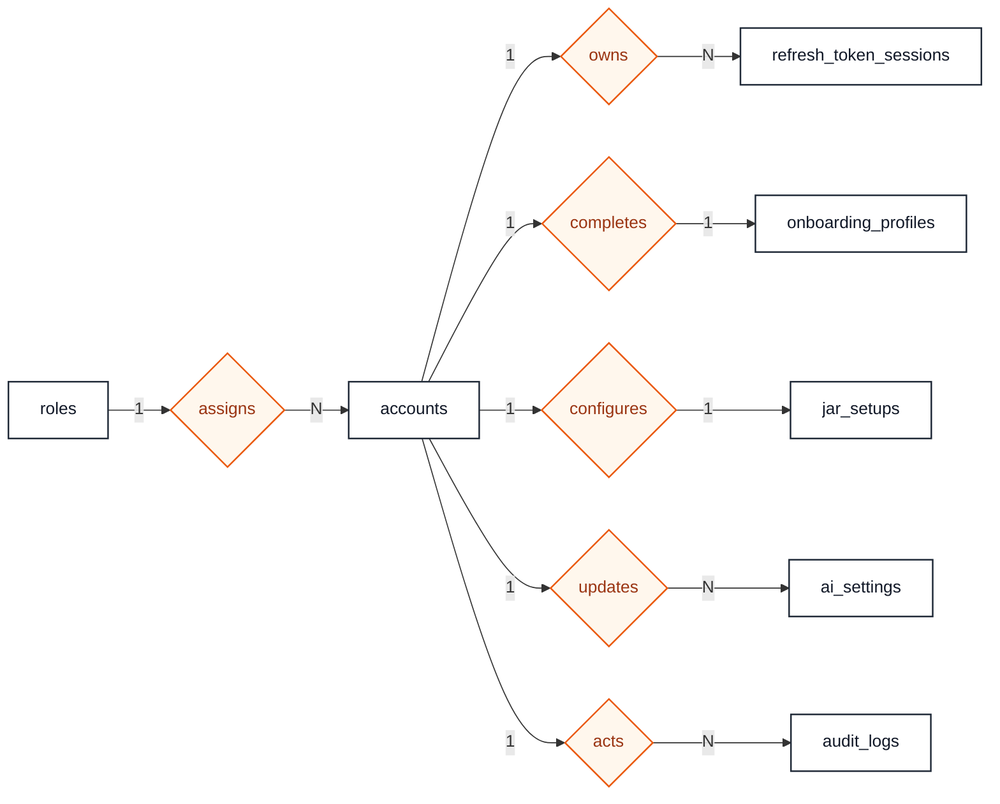
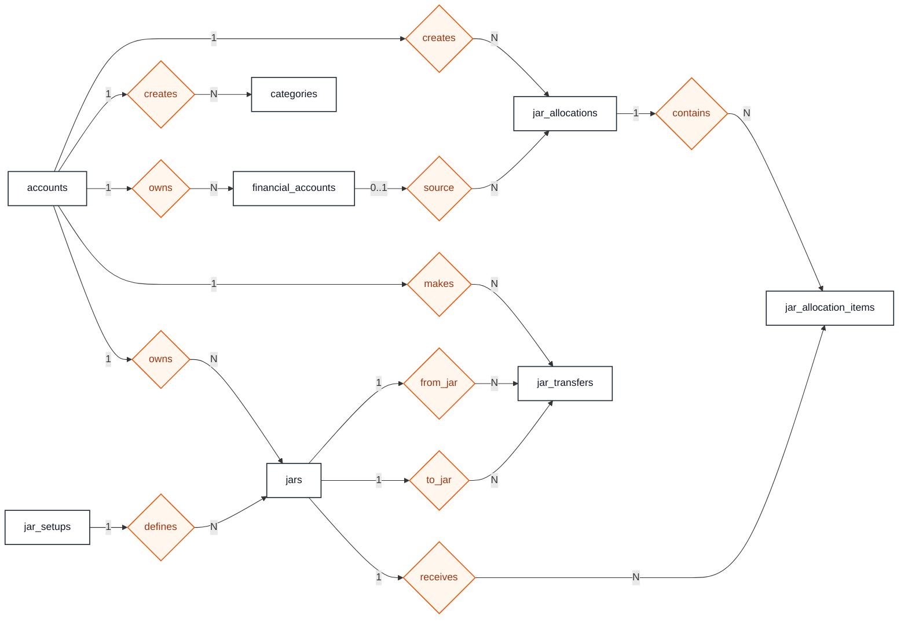
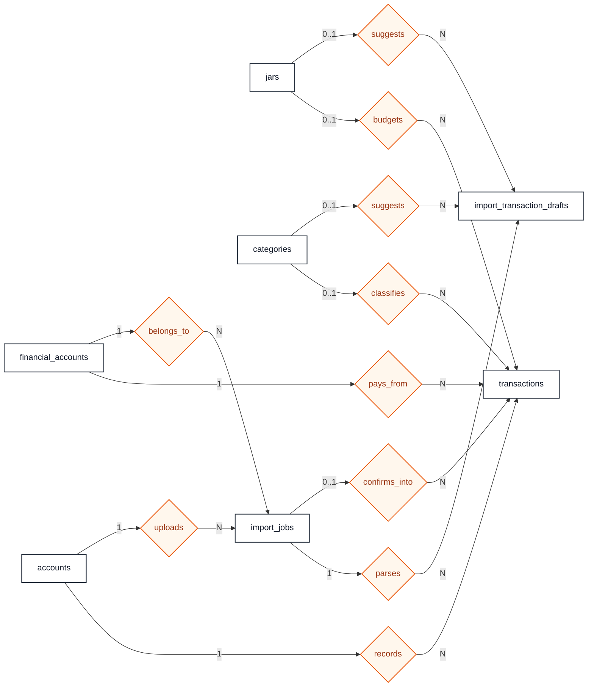
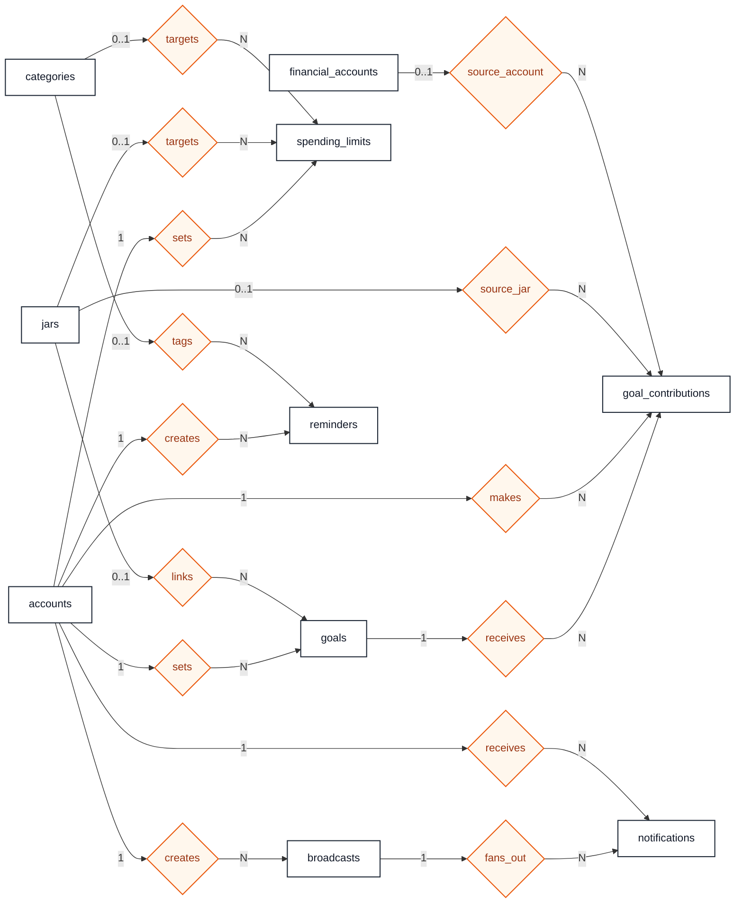

    # Đề xuất schema database cho scope 1 tháng đầu

## 1. Mục tiêu thiết kế lại

Schema này được thiết kế lại theo ba nguyên tắc đã chốt:

- `accounts` là **tài khoản đăng nhập** của hệ thống, không phải tài khoản ngân hàng.
- `financial_accounts` là **nguồn tiền** của user, dùng chung cho cả tiền mặt nhập tay và tài khoản ngân hàng liên kết qua API.
- `jars` là **hũ ngân sách**, dùng để chia mục đích chi tiêu, không phải nơi hệ thống giữ tiền thật.

Hướng này phù hợp với tài liệu gốc:

- hệ thống **không giữ tiền của người dùng**;
- user không liên kết ngân hàng vẫn phải dùng được bình thường;
- ngân hàng API chỉ là một cách lấy dữ liệu, không phải điều kiện bắt buộc để app hoạt động.

## 2. Khái niệm cốt lõi

### 2.1. Phân biệt 3 lớp dữ liệu

#### `accounts`

- tài khoản đăng nhập app;
- phục vụ auth, role, profile, audit.

#### `financial_accounts`

- nguồn tiền thực tế mà user đang theo dõi;
- có thể là:
  - `Cash`
  - `Bank`
  - `EWallet`
  - `Other`
- có thể ở 2 chế độ:
  - `Manual`: user tự nhập và tự chỉnh số dư
  - `LinkedApi`: dữ liệu lấy từ tích hợp bên ngoài

#### `jars`

- lớp ngân sách nội bộ;
- dùng để chia tiền theo mục tiêu chi tiêu;
- không đại diện cho tài khoản ngân hàng hay ví thật.

### 2.2. Cách hiểu các field liên quan đến nguồn tiền

FinJar là hệ thống **non-custodial**: app không giữ tiền, không tạo ví thật và không tự chuyển tiền thật trong tài khoản ngân hàng của user. Các thao tác như phân bổ tiền vào jar, chuyển giữa jar hoặc đóng góp vào goal chỉ là thao tác ghi nhận/phân loại ngân sách trong app.

Vì vậy, các field có chữ `financial_account` cần được hiểu như sau:

| Field | Nằm ở bảng | Ý nghĩa lưu trữ | Không có nghĩa là |
| --- | --- | --- | --- |
| `financial_account_id` | `transactions` | giao dịch thu/chi này phát sinh từ nguồn tiền thật nào, ví dụ `Tiền mặt`, `Vietcombank`, `MoMo` | app giữ tiền hoặc thực hiện chuyển khoản |
| `financial_account_id` | `import_jobs` | file sao kê/import này thuộc nguồn tiền hoặc tài khoản ngân hàng nào | file import tạo tài khoản ngân hàng mới |
| `source_financial_account_id` | `jar_allocations` | khoản phân bổ vào jar được quy chiếu từ nguồn tiền thật nào | app rút tiền khỏi ngân hàng để nạp vào jar |
| `source_financial_account_id` | `goal_contributions` | khoản đóng góp goal được quy chiếu từ nguồn tiền thật nào nếu không đi từ một jar | app chuyển tiền thật vào goal |

Ví dụ:

- User link tài khoản `Vietcombank` có số dư 10.000.000 VND.
- User phân bổ 3.000.000 VND vào jar `Ăn uống`.
- Tiền thật vẫn nằm ở `Vietcombank`.
- App chỉ ghi nhận rằng trong lớp ngân sách nội bộ, 3.000.000 VND đang được dành cho jar `Ăn uống`.

Khi đặt tên API/UI, nên ưu tiên các từ như:

- `nguồn tiền`
- `tài khoản liên kết`
- `phân bổ ngân sách`
- `gắn giao dịch với nguồn tiền`
- `chuyển ngân sách giữa các hũ`

Nên tránh diễn đạt như:

- `nạp tiền vào jar`
- `rút tiền từ ngân hàng vào app`
- `chuyển tiền từ tài khoản ngân hàng sang hũ`

Các cách nói này dễ làm người dùng hiểu nhầm rằng FinJar đang giữ hoặc điều khiển tiền thật.

### 2.3. Dashboard sẽ tính như thế nào

- `total_balance = SUM(financial_accounts.current_balance)`
- `allocated_balance = SUM(jars.balance)`
- `unallocated_balance = total_balance - allocated_balance`

Ghi chú:

- `total_balance` là tổng số dư của các nguồn tiền user đang theo dõi.
- `allocated_balance` là tổng số tiền đã được phân bổ vào các jar trong app.
- `unallocated_balance` là phần tiền thật đang được theo dõi nhưng chưa được gán vào jar nào.
- Công thức này phục vụ quản lý ngân sách, không phải sổ cái ngân hàng.

### 2.4. User không liên kết ngân hàng thì sao

Sau onboarding, hệ thống nên tự tạo một `financial_account` mặc định:

- `name = "Tiền mặt"`
- `account_type = "Cash"`
- `connection_mode = "Manual"`
- `is_default = true`

Nhờ vậy:

- học sinh chỉ có tiền mặt vẫn dùng app được;
- user không cần bank link vẫn tạo giao dịch, phân bổ hũ và theo dõi dashboard;
- linked bank chỉ là tính năng mở rộng thêm.

## 3. Quyết định thiết kế chính

### 3.1. Công nghệ và quy ước

- Database: `PostgreSQL`
- Primary key: `uuid`, dùng `gen_random_uuid()`
- Timestamp: `timestamptz`
- Amount/balance: `numeric(18,2)`
- Tên bảng/cột: `snake_case`

### 3.2. Cách lưu enum trong tháng đầu

Trong phase đầu nên lưu bằng `varchar` kèm `check constraint`, thay vì PostgreSQL enum.

Các enum chính:

- `user_role`: `User`, `Admin`, `SuperAdmin`
- `account_status`: `Active`, `Banned`
- `financial_account_type`: `Cash`, `Bank`, `EWallet`, `Other`
- `connection_mode`: `Manual`, `LinkedApi`
- `sync_status`: `NeverSynced`, `Synced`, `Syncing`, `Error`, `Disconnected`
- `budget_method_type`: `SixJars`, `Rule503020`, `Custom`, `Undecided`
- `jar_status`: `Active`, `Paused`, `Archived`
- `transaction_type`: `Income`, `Expense`
- `transaction_source_type`: `Manual`, `Imported`, `OCR`, `Synced`, `System`
- `limit_period_type`: `Daily`, `Monthly`
- `notification_type`: `SpendingAlert`, `GoalUpdate`, `Reminder`, `System`, `Broadcast`
- `goal_status`: `Active`, `Completed`, `Cancelled`
- `reminder_frequency`: `Daily`, `Weekly`, `Monthly`, `Quarterly`, `Yearly`
- `reminder_status`: `Active`, `Paused`, `Completed`, `Cancelled`
- `import_job_status`: `Pending`, `Processing`, `AwaitingReview`, `Completed`, `Failed`
- `broadcast_status`: `Queued`, `Sent`, `Failed`, `Cancelled`

### 3.3. Phạm vi tháng đầu

Trong tháng đầu:

- có `financial_accounts`;
- có tiền mặt nhập tay và bank account linked về mặt schema;
- chưa làm ledger double-entry;
- chưa làm shared jar;
- chưa làm OCR receipt table riêng;
- chưa làm chat/session analytics chuyên sâu.

## 4. Danh sách bảng đề xuất

### 4.1. Identity và access

### `roles`

Mục đích: seed role cho auth và authorization.

Field chính:

- `id uuid primary key`
- `code varchar(30) not null unique`
- `name varchar(50) not null`
- `description text null`
- `created_at timestamptz not null default now()`

### `accounts`

Mục đích: tài khoản đăng nhập của user/admin.

Field chính:

- `id uuid primary key`
- `role_id uuid not null references roles(id)`
- `username varchar(50) not null unique`
- `email varchar(255) not null unique`
- `password_hash text not null`
- `full_name varchar(150) not null`
- `phone varchar(20) null`
- `avatar_url text null`
- `status varchar(20) not null default 'Active'`
- `status_reason text null`
- `preferred_currency char(3) not null default 'VND'`
- `is_onboarding_completed boolean not null default false`
- `last_login_at timestamptz null`
- `created_at timestamptz not null default now()`
- `updated_at timestamptz not null default now()`

Index quan trọng:

- `uq_accounts_username`
- `uq_accounts_email`
- `ix_accounts_role_status`
- `ix_accounts_last_login_at`

### `refresh_token_sessions`

Mục đích: quản lý refresh token.

Field chính:

- `id uuid primary key`
- `account_id uuid not null references accounts(id)`
- `token_hash text not null`
- `expires_at timestamptz not null`
- `revoked_at timestamptz null`
- `replaced_by_token_hash text null`
- `created_by_ip inet null`
- `revoked_by_ip inet null`
- `user_agent text null`
- `created_at timestamptz not null default now()`

### `ai_settings`

Mục đích: lưu cấu hình AI ở phía admin.

Field chính:

- `id uuid primary key`
- `model_name varchar(100) not null`
- `system_prompt text not null`
- `temperature numeric(3,2) not null default 0.7`
- `max_tokens int not null default 1000`
- `api_key_encrypted text null`
- `is_enabled boolean not null default true`
- `updated_by_admin_id uuid null references accounts(id)`
- `updated_at timestamptz not null default now()`

Ghi chú:

- bảng này có thể chỉ có 1 record active trong phase đầu.

### 4.2. Onboarding và financial setup

### `onboarding_profiles`

Mục đích: lưu kết quả khảo sát ban đầu.

Field chính:

- `id uuid primary key`
- `user_id uuid not null unique references accounts(id)`
- `monthly_income numeric(18,2) null`
- `occupation_type varchar(50) null`
- `financial_goal_types text[] null`
- `budget_method_preference varchar(30) not null default 'Undecided'`
- `age_range varchar(30) null`
- `spending_challenges text[] null`
- `recommended_method varchar(30) null`
- `completed_at timestamptz not null`
- `created_at timestamptz not null default now()`
- `updated_at timestamptz not null default now()`

### `jar_setups`

Mục đích: lưu phương pháp budgeting hiện tại của user.

Field chính:

- `id uuid primary key`
- `user_id uuid not null unique references accounts(id)`
- `method_type varchar(30) not null`
- `created_at timestamptz not null default now()`
- `updated_at timestamptz not null default now()`

Ghi chú:

- không cần `initial_balance` ở đây nữa vì số dư gốc đã nằm ở `financial_accounts`.

### 4.3. Nguồn tiền, danh mục và hũ

### `financial_accounts`

Mục đích: bảng nguồn tiền trung tâm, dùng cho cả tiền mặt và tài khoản liên kết.

Field chính:

- `id uuid primary key`
- `user_id uuid not null references accounts(id)`
- `name varchar(100) not null`
- `account_type varchar(20) not null`
- `connection_mode varchar(20) not null`
- `provider_code varchar(50) null`
- `provider_name varchar(100) null`
- `external_account_id varchar(150) null`
- `external_account_ref varchar(150) null`
- `masked_account_number varchar(50) null`
- `account_holder_name varchar(150) null`
- `currency char(3) not null default 'VND'`
- `current_balance numeric(18,2) not null default 0`
- `available_balance numeric(18,2) null`
- `balance_as_of timestamptz null`
- `sync_status varchar(20) not null default 'NeverSynced'`
- `last_synced_at timestamptz null`
- `last_sync_error text null`
- `access_token_ref text null`
- `refresh_token_ref text null`
- `token_expires_at timestamptz null`
- `consent_expires_at timestamptz null`
- `last_sync_cursor text null`
- `webhook_subscription_id varchar(150) null`
- `is_default boolean not null default false`
- `is_active boolean not null default true`
- `created_at timestamptz not null default now()`
- `updated_at timestamptz not null default now()`

Ràng buộc nên có:

- `current_balance >= 0`
- nếu `connection_mode = 'Manual'` thì `provider_code` và `external_account_id` có thể `null`
- nếu `connection_mode = 'LinkedApi'` thì `provider_code` và `external_account_id` phải có

Unique/index gợi ý:

- unique partial `(user_id, provider_code, external_account_id)` với record linked active
- `ix_financial_accounts_user_id`
- `ix_financial_accounts_user_id_is_default`
- `ix_financial_accounts_sync_status`

Ghi chú:

- `financial_accounts` là nguồn tiền để theo dõi và đối chiếu, không phải ví do FinJar phát hành;
- với `connection_mode = 'LinkedApi'`, app chỉ lưu metadata/token reference để đồng bộ dữ liệu theo quyền user đã cấp;
- với `connection_mode = 'Manual'`, số dư do user nhập/chỉnh thủ công, phù hợp cho tiền mặt hoặc nguồn tiền chưa liên kết;
- `current_balance` là số dư app đang biết tại thời điểm gần nhất, có thể đến từ user nhập tay, import sao kê hoặc đồng bộ API;
- `available_balance` nếu có thì phản ánh số dư khả dụng do provider trả về, không bắt buộc trong phase đầu;
- `balance_as_of` dùng để biết số dư đang được tính tại thời điểm nào, rất quan trọng khi dữ liệu đến từ bank sync;
- không nên lưu raw access token nếu tránh được;
- `access_token_ref` và `refresh_token_ref` nên là dữ liệu đã mã hóa hoặc reference sang secret store.

### `categories`

Mục đích: lưu category mặc định và custom category.

Field chính:

- `id uuid primary key`
- `name varchar(100) not null`
- `icon varchar(50) null`
- `color varchar(20) null`
- `is_default boolean not null default false`
- `owner_user_id uuid null references accounts(id)`
- `display_order int not null default 0`
- `is_active boolean not null default true`
- `deleted_at timestamptz null`
- `created_at timestamptz not null default now()`
- `updated_at timestamptz not null default now()`

### `jars`

Mục đích: lớp ngân sách nội bộ.

Field chính:

- `id uuid primary key`
- `user_id uuid not null references accounts(id)`
- `jar_setup_id uuid null references jar_setups(id)`
- `name varchar(100) not null`
- `percentage numeric(5,2) null`
- `balance numeric(18,2) not null default 0`
- `currency char(3) not null default 'VND'`
- `color varchar(20) null`
- `icon varchar(50) null`
- `is_default boolean not null default false`
- `status varchar(20) not null default 'Active'`
- `created_at timestamptz not null default now()`
- `updated_at timestamptz not null default now()`

Ràng buộc nên có:

- `balance >= 0`
- `status in ('Active', 'Paused', 'Archived')`

### `jar_allocations`

Mục đích: ghi một lần phân bổ tiền từ tổng số dư vào nhiều hũ.

Field chính:

- `id uuid primary key`
- `user_id uuid not null references accounts(id)`
- `source_financial_account_id uuid null references financial_accounts(id)`
- `total_amount numeric(18,2) not null`
- `note text null`
- `created_at timestamptz not null default now()`

Ghi chú:

- `source_financial_account_id` có thể `null` với allocation tạo tự động lúc onboarding;
- nếu user chọn nguồn cụ thể để phân bổ thì lưu vào đây;
- field này chỉ nói "khoản phân bổ được quy chiếu từ nguồn tiền nào", không có nghĩa là app chuyển tiền thật khỏi ngân hàng;
- khi allocation có `source_financial_account_id`, backend nên kiểm tra nguồn tiền đó thuộc đúng `user_id`;
- tổng `total_amount` nên bằng tổng các dòng trong `jar_allocation_items`;
- trong tháng đầu, record này chủ yếu phục vụ truy vết nghiệp vụ, không phải ledger cứng.

### `jar_allocation_items`

Mục đích: lưu chi tiết mỗi hũ nhận bao nhiêu tiền trong một allocation.

Field chính:

- `id uuid primary key`
- `allocation_id uuid not null references jar_allocations(id)`
- `jar_id uuid not null references jars(id)`
- `amount numeric(18,2) not null`
- `balance_after_allocation numeric(18,2) not null`

### `jar_transfers`

Mục đích: lưu lịch sử chuyển ngân sách giữa các hũ.

Field chính:

- `id uuid primary key`
- `user_id uuid not null references accounts(id)`
- `from_jar_id uuid not null references jars(id)`
- `to_jar_id uuid not null references jars(id)`
- `amount numeric(18,2) not null`
- `note text null`
- `created_at timestamptz not null default now()`

Ràng buộc nên có:

- `amount > 0`
- `from_jar_id <> to_jar_id`

Ghi chú:

- `jar_transfers` chỉ chuyển ngân sách nội bộ giữa hai jar;
- thao tác này không làm phát sinh giao dịch ngân hàng và không gọi API chuyển tiền thật;
- backend chỉ cập nhật `jars.balance` của hai jar liên quan, không tự ý cập nhật số dư ngân hàng trừ khi có rule nghiệp vụ riêng được thiết kế rõ.

### 4.4. Transaction và import

### `transactions`

Mục đích: lưu giao dịch thu/chi đã được user xác nhận.

Field chính:

- `id uuid primary key`
- `user_id uuid not null references accounts(id)`
- `financial_account_id uuid not null references financial_accounts(id)`
- `jar_id uuid null references jars(id)`
- `category_id uuid null references categories(id)`
- `import_job_id uuid null references import_jobs(id)`
- `type varchar(20) not null`
- `amount numeric(18,2) not null`
- `note text null`
- `raw_description text null`
- `transaction_date timestamptz not null`
- `posted_at timestamptz null`
- `source_type varchar(20) not null default 'Manual'`
- `external_transaction_id varchar(150) null`
- `raw_payload_json jsonb null`
- `is_deleted boolean not null default false`
- `deleted_at timestamptz null`
- `created_at timestamptz not null default now()`
- `updated_at timestamptz not null default now()`

Ràng buộc nên có:

- `amount > 0`
- `type in ('Income', 'Expense')`
- nếu `type = 'Expense'` thì `jar_id is not null`

Unique/index gợi ý:

- unique partial `(financial_account_id, external_transaction_id)` khi `external_transaction_id is not null`
- `ix_transactions_user_id_transaction_date`
- `ix_transactions_financial_account_id_transaction_date`
- `ix_transactions_user_id_jar_id_transaction_date`
- `ix_transactions_user_id_category_id_transaction_date`

Ghi chú:

- mỗi transaction phải đi qua một `financial_account` để biết giao dịch phát sinh từ nguồn tiền thật nào;
- với user chỉ có tiền mặt, transaction sẽ trỏ tới record `Tiền mặt`;
- với tài khoản ngân hàng liên kết, transaction có thể đến từ sync/import và trỏ về đúng bank account đó;
- `financial_account_id` không có nghĩa là app đang giữ tiền, mà chỉ là khóa tham chiếu để phân loại nguồn phát sinh giao dịch;
- expense sẽ làm giảm cả `financial_accounts.current_balance` và `jars.balance` theo xử lý nghiệp vụ backend nếu giao dịch có gắn jar;
- income thường làm tăng `financial_accounts.current_balance`; việc tự động phân bổ income vào jar hay để unallocated là rule nghiệp vụ riêng.

### `import_jobs`

Mục đích: đại diện cho một lần import file sao kê.

Field chính:

- `id uuid primary key`
- `user_id uuid not null references accounts(id)`
- `financial_account_id uuid not null references financial_accounts(id)`
- `file_name varchar(255) not null`
- `original_content_type varchar(100) null`
- `stored_file_path text not null`
- `bank_code varchar(50) null`
- `status varchar(30) not null default 'Pending'`
- `progress int not null default 0`
- `estimated_rows int null`
- `parsed_count int not null default 0`
- `failed_count int not null default 0`
- `error_message text null`
- `uploaded_at timestamptz not null default now()`
- `updated_at timestamptz not null default now()`

Ghi chú:

- `financial_account_id` xác định file sao kê này thuộc nguồn tiền/tài khoản nào;
- khi confirm import, các transaction thật tạo ra từ draft nên kế thừa `financial_account_id` của `import_jobs`;
- nếu user upload sao kê Vietcombank thì job phải trỏ tới financial account Vietcombank, không trỏ nhầm sang `Tiền mặt` hoặc ví khác;
- `bank_code` là metadata hỗ trợ parser, còn `financial_account_id` mới là khóa nghiệp vụ để gắn dữ liệu vào nguồn tiền của user.

### `import_transaction_drafts`

Mục đích: lưu các dòng parse ra để user review trước khi confirm.

Field chính:

- `id uuid primary key`
- `import_job_id uuid not null references import_jobs(id)`
- `row_index int not null`
- `transaction_date timestamptz null`
- `amount numeric(18,2) null`
- `type varchar(20) null`
- `raw_description text null`
- `suggested_note text null`
- `suggested_category_id uuid null references categories(id)`
- `suggested_jar_id uuid null references jars(id)`
- `is_valid boolean not null default true`
- `validation_error text null`
- `normalized_payload_json jsonb null`
- `created_at timestamptz not null default now()`
- `updated_at timestamptz not null default now()`

Unique gợi ý:

- unique `(import_job_id, row_index)`

### 4.5. Limits, goals, reminders, notifications

### `spending_limits`

Mục đích: hạn mức theo jar hoặc category.

Field chính:

- `id uuid primary key`
- `user_id uuid not null references accounts(id)`
- `jar_id uuid null references jars(id)`
- `category_id uuid null references categories(id)`
- `limit_amount numeric(18,2) not null`
- `period varchar(20) not null`
- `alert_at_percentage numeric(5,2) not null`
- `is_active boolean not null default true`
- `created_at timestamptz not null default now()`
- `updated_at timestamptz not null default now()`

Ràng buộc nên có:

- chỉ set một trong hai: `jar_id` hoặc `category_id`

### `goals`

Mục đích: lưu mục tiêu tiết kiệm.

Field chính:

- `id uuid primary key`
- `user_id uuid not null references accounts(id)`
- `title varchar(150) not null`
- `target_amount numeric(18,2) not null`
- `saved_amount numeric(18,2) not null default 0`
- `due_date date not null`
- `status varchar(20) not null default 'Active'`
- `linked_jar_id uuid null references jars(id)`
- `note text null`
- `created_at timestamptz not null default now()`
- `updated_at timestamptz not null default now()`

### `goal_contributions`

Mục đích: lưu từng lần đóng góp vào goal.

Field chính:

- `id uuid primary key`
- `goal_id uuid not null references goals(id)`
- `user_id uuid not null references accounts(id)`
- `source_jar_id uuid null references jars(id)`
- `source_financial_account_id uuid null references financial_accounts(id)`
- `amount numeric(18,2) not null`
- `note text null`
- `created_at timestamptz not null default now()`

Ràng buộc nên có:

- `amount > 0`
- chỉ set một trong hai: `source_jar_id` hoặc `source_financial_account_id`

Ghi chú:

- `source_jar_id` dùng khi user muốn lấy phần ngân sách đã phân bổ trong một jar để ghi nhận đóng góp goal;
- `source_financial_account_id` dùng khi user muốn ghi nhận đóng góp trực tiếp từ một nguồn tiền thật, không đi qua jar;
- cả hai trường trên vẫn chỉ là ghi nhận/phân loại ngân sách trong app, không đại diện cho lệnh chuyển tiền thật;
- nếu goal có `linked_jar_id`, backend có thể ưu tiên flow đóng góp từ jar để dashboard goal và jar nhất quán hơn.

### `reminders`

Mục đích: lịch nhắc thanh toán định kỳ.

Field chính:

- `id uuid primary key`
- `user_id uuid not null references accounts(id)`
- `title varchar(150) not null`
- `amount numeric(18,2) null`
- `frequency varchar(20) not null`
- `day_of_month smallint null`
- `start_date date not null`
- `next_due_date date not null`
- `category_id uuid null references categories(id)`
- `note text null`
- `status varchar(20) not null default 'Active'`
- `notify_days_before smallint not null default 1`
- `created_at timestamptz not null default now()`
- `updated_at timestamptz not null default now()`

### `broadcasts`

Mục đích: lưu chiến dịch broadcast của admin.

Field chính:

- `id uuid primary key`
- `created_by_admin_id uuid not null references accounts(id)`
- `title varchar(200) not null`
- `body text not null`
- `target_audience varchar(50) not null default 'All'`
- `status varchar(20) not null default 'Queued'`
- `scheduled_at timestamptz null`
- `sent_at timestamptz null`
- `target_count int not null default 0`
- `delivered_count int not null default 0`
- `created_at timestamptz not null default now()`
- `updated_at timestamptz not null default now()`

### `notifications`

Mục đích: inbox thông báo in-app của user.

Field chính:

- `id uuid primary key`
- `user_id uuid not null references accounts(id)`
- `type varchar(30) not null`
- `title varchar(200) not null`
- `body text not null`
- `is_read boolean not null default false`
- `read_at timestamptz null`
- `broadcast_id uuid null references broadcasts(id)`
- `metadata_json jsonb null`
- `created_at timestamptz not null default now()`

### 4.6. Admin và audit

### `audit_logs`

Mục đích: ghi thao tác nhạy cảm của admin.

Field chính:

- `id uuid primary key`
- `actor_account_id uuid not null references accounts(id)`
- `action_type varchar(50) not null`
- `entity_type varchar(50) not null`
- `entity_id uuid null`
- `description text not null`
- `metadata_json jsonb null`
- `ip_address inet null`
- `created_at timestamptz not null default now()`

## 5. Quan hệ chính

- `roles 1-N accounts`
- `accounts 1-N refresh_token_sessions`
- `accounts 1-1 onboarding_profiles`
- `accounts 1-1 jar_setups`
- `accounts 1-N financial_accounts`
- `accounts 1-N categories`
- `accounts 1-N jars`
- `accounts 1-N transactions`
- `accounts 1-N spending_limits`
- `accounts 1-N goals`
- `accounts 1-N reminders`
- `accounts 1-N notifications`
- `accounts 1-N import_jobs`
- `financial_accounts 1-N transactions`
- `financial_accounts 1-N import_jobs`
- `financial_accounts 1-N goal_contributions`
- `jars 1-N transactions`
- `jars 1-N jar_transfers`
- `jars 1-N goal_contributions`
- `goals 1-N goal_contributions`
- `broadcasts 1-N notifications`
- `import_jobs 1-N import_transaction_drafts`

## 6. Thứ tự migration gợi ý

### Migration 1

- `roles`
- `accounts`
- `refresh_token_sessions`
- `audit_logs`

### Migration 2

- `onboarding_profiles`
- `jar_setups`
- `financial_accounts`
- `categories`
- `jars`

### Migration 3

- `jar_allocations`
- `jar_allocation_items`
- `jar_transfers`
- `transactions`

### Migration 4

- `spending_limits`
- `goals`
- `goal_contributions`
- `reminders`
- `broadcasts`
- `notifications`

### Migration 5

- `import_jobs`
- `import_transaction_drafts`

### Migration 6

- `ai_settings`

## 7. Những gì chưa nên làm trong tháng đầu

- `balance_ledger_entries`
- `receipt_scans`
- `chat_sessions`, `chat_messages`
- `shared_jars`, `jar_members`
- analytics riêng cho DAU, WAU, MAU, retention

## 8. Kết luận chốt thiết kế

Thiết kế mới này giải quyết được đúng điểm đang vướng:

- user không liên kết ngân hàng vẫn dùng được nhờ `financial_accounts` kiểu `Cash`;
- linked bank có chỗ đứng rõ ràng trong schema mà không làm sai bản chất non-custodial;
- `accounts` không còn bị nhập nhằng với bank account;
- dashboard có công thức rõ cho `total`, `allocated`, `unallocated`;
- `jars` vẫn giữ vai trò budget, không biến thành ví hay tài khoản thật.

Nếu triển khai theo schema này, tháng đầu team có thể build đủ lõi nghiệp vụ mà vẫn còn đường mở rộng sạch cho phase sau.

## Phụ lục: Mermaid ERD

```mermaid
erDiagram
    ROLES {
        uuid id PK
        varchar code
        varchar name
    }

    ACCOUNTS {
        uuid id PK
        uuid role_id FK
        varchar username
        varchar email
        varchar status
        boolean is_onboarding_completed
        timestamptz last_login_at
    }

    REFRESH_TOKEN_SESSIONS {
        uuid id PK
        uuid account_id FK
        timestamptz expires_at
        timestamptz revoked_at
    }

    ONBOARDING_PROFILES {
        uuid id PK
        uuid user_id FK
        decimal monthly_income
        varchar budget_method_preference
        varchar recommended_method
    }

    JAR_SETUPS {
        uuid id PK
        uuid user_id FK
        varchar method_type
    }

    FINANCIAL_ACCOUNTS {
        uuid id PK
        uuid user_id FK
        varchar name
        varchar account_type
        varchar connection_mode
        varchar provider_code
        varchar external_account_id
        decimal current_balance
        varchar sync_status
        boolean is_default
        boolean is_active
    }

    CATEGORIES {
        uuid id PK
        uuid owner_user_id FK
        varchar name
        boolean is_default
        boolean is_active
    }

    JARS {
        uuid id PK
        uuid user_id FK
        uuid jar_setup_id FK
        varchar name
        decimal percentage
        decimal balance
        varchar status
    }

    JAR_ALLOCATIONS {
        uuid id PK
        uuid user_id FK
        uuid source_financial_account_id FK
        decimal total_amount
        timestamptz created_at
    }

    JAR_ALLOCATION_ITEMS {
        uuid id PK
        uuid allocation_id FK
        uuid jar_id FK
        decimal amount
        decimal balance_after_allocation
    }

    JAR_TRANSFERS {
        uuid id PK
        uuid user_id FK
        uuid from_jar_id FK
        uuid to_jar_id FK
        decimal amount
    }

    TRANSACTIONS {
        uuid id PK
        uuid user_id FK
        uuid financial_account_id FK
        uuid jar_id FK
        uuid category_id FK
        uuid import_job_id FK
        varchar type
        decimal amount
        varchar source_type
        timestamptz transaction_date
    }

    IMPORT_JOBS {
        uuid id PK
        uuid user_id FK
        uuid financial_account_id FK
        varchar file_name
        varchar status
    }

    IMPORT_TRANSACTION_DRAFTS {
        uuid id PK
        uuid import_job_id FK
        uuid suggested_category_id FK
        uuid suggested_jar_id FK
        int row_index
        decimal amount
        boolean is_valid
    }

    SPENDING_LIMITS {
        uuid id PK
        uuid user_id FK
        uuid jar_id FK
        uuid category_id FK
        decimal limit_amount
        varchar period
    }

    GOALS {
        uuid id PK
        uuid user_id FK
        uuid linked_jar_id FK
        varchar title
        decimal target_amount
        decimal saved_amount
        varchar status
    }

    GOAL_CONTRIBUTIONS {
        uuid id PK
        uuid goal_id FK
        uuid user_id FK
        uuid source_jar_id FK
        uuid source_financial_account_id FK
        decimal amount
    }

    REMINDERS {
        uuid id PK
        uuid user_id FK
        uuid category_id FK
        varchar title
        decimal amount
        varchar frequency
    }

    BROADCASTS {
        uuid id PK
        uuid created_by_admin_id FK
        varchar title
        varchar status
    }

    NOTIFICATIONS {
        uuid id PK
        uuid user_id FK
        uuid broadcast_id FK
        varchar type
        boolean is_read
    }

    AUDIT_LOGS {
        uuid id PK
        uuid actor_account_id FK
        varchar action_type
        varchar entity_type
    }

    AI_SETTINGS {
        uuid id PK
        uuid updated_by_admin_id FK
        varchar model_name
        boolean is_enabled
    }

    ROLES ||--o{ ACCOUNTS : assigns
    ACCOUNTS ||--o{ REFRESH_TOKEN_SESSIONS : owns
    ACCOUNTS ||--|| ONBOARDING_PROFILES : completes
    ACCOUNTS ||--|| JAR_SETUPS : configures
    ACCOUNTS ||--o{ FINANCIAL_ACCOUNTS : owns
    ACCOUNTS ||--o{ CATEGORIES : creates
    ACCOUNTS ||--o{ JARS : owns
    JAR_SETUPS ||--o{ JARS : defines

    ACCOUNTS ||--o{ JAR_ALLOCATIONS : creates
    FINANCIAL_ACCOUNTS o|--o{ JAR_ALLOCATIONS : source
    JAR_ALLOCATIONS ||--o{ JAR_ALLOCATION_ITEMS : contains
    JARS ||--o{ JAR_ALLOCATION_ITEMS : receives

    ACCOUNTS ||--o{ JAR_TRANSFERS : makes
    JARS ||--o{ JAR_TRANSFERS : from_jar
    JARS ||--o{ JAR_TRANSFERS : to_jar

    ACCOUNTS ||--o{ TRANSACTIONS : records
    FINANCIAL_ACCOUNTS ||--o{ TRANSACTIONS : pays_from
    JARS ||--o{ TRANSACTIONS : budgets
    CATEGORIES ||--o{ TRANSACTIONS : classifies
    IMPORT_JOBS o|--o{ TRANSACTIONS : confirms_into

    ACCOUNTS ||--o{ IMPORT_JOBS : uploads
    FINANCIAL_ACCOUNTS ||--o{ IMPORT_JOBS : belongs_to
    IMPORT_JOBS ||--o{ IMPORT_TRANSACTION_DRAFTS : parses
    CATEGORIES ||--o{ IMPORT_TRANSACTION_DRAFTS : suggests
    JARS ||--o{ IMPORT_TRANSACTION_DRAFTS : suggests

    ACCOUNTS ||--o{ SPENDING_LIMITS : sets
    JARS ||--o{ SPENDING_LIMITS : targets
    CATEGORIES ||--o{ SPENDING_LIMITS : targets

    ACCOUNTS ||--o{ GOALS : sets
    JARS ||--o{ GOALS : links
    GOALS ||--o{ GOAL_CONTRIBUTIONS : receives
    ACCOUNTS ||--o{ GOAL_CONTRIBUTIONS : makes
    JARS o|--o{ GOAL_CONTRIBUTIONS : source_jar
    FINANCIAL_ACCOUNTS o|--o{ GOAL_CONTRIBUTIONS : source_account

    ACCOUNTS ||--o{ REMINDERS : creates
    CATEGORIES ||--o{ REMINDERS : tags

    ACCOUNTS ||--o{ BROADCASTS : creates
    BROADCASTS ||--o{ NOTIFICATIONS : fans_out
    ACCOUNTS ||--o{ NOTIFICATIONS : receives

    ACCOUNTS ||--o{ AUDIT_LOGS : acts
    ACCOUNTS ||--o{ AI_SETTINGS : updates
```

## Phụ lục: Sơ đồ quan hệ chỉ gồm entity và relationship

Mermaid chưa có Chen ERD native, nên phần này dùng `flowchart` với:

- `entity` là hình chữ nhật;
- `relationship` là hình thoi;
- bỏ toàn bộ attribute để tập trung vào bố cục quan hệ;
- tách theo domain để khi render trong Markdown không bị quá rối.

### 1. Identity, onboarding và admin

### 2. Nguồn tiền, category và jars

### 3. Transactions và import

### 4. Limits, goals, reminders và notifications

### Ghi chú khi đọc sơ đồ

- `accounts` là tài khoản đăng nhập; `financial_accounts` là nguồn tiền; `jars` là ngân sách.
- phần `entity-only` ở trên cố ý lặp lại một số entity giữa các sơ đồ để mỗi domain dễ nhìn hơn.
- nếu muốn gom hết thành một sơ đồ duy nhất thì vẫn làm được, nhưng lúc render trong Markdown sẽ rất dày và khó đọc hơn bản chia domain.
- `spending_limits` và `goal_contributions` đều có quan hệ XOR mà Mermaid không thể hiện trọn vẹn bằng sơ đồ.
- `financial_accounts` đã gộp cả metadata manual và linked API vào một bảng để phase đầu dễ triển khai hơn.
